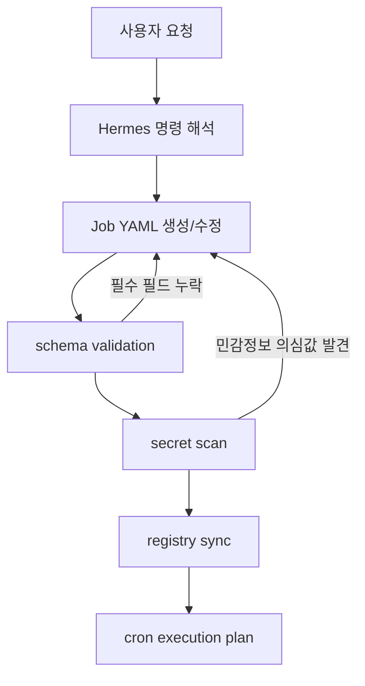

# Personal Hermes Agent

> **Sanitized AI Agent Operations Profile & Job Registry**  
> 공개 가능한 AI 에이전트 운영 아키텍처 및 Job Registry 포트폴리오

## 1. Overview

이 저장소는 개인 Hermes Agent 운영 프로필을 공개 가능한 형태로 정리한 **AI 에이전트 운영 아키텍처 및 Job Registry 포트폴리오**입니다.

AI 에이전트 시스템을 단순 대화형 도구가 아니라, 입력 라우팅, 도구 실행, 작업 예약, 메모리 반영, 모델 선택, 위임 실행까지 포함하는 운영 단위로 보고 다음 구조를 문서화했습니다.

- AI 에이전트 운영 구조
- Job Registry 기반 워크플로 자동화
- Gateway / Tools / Cron / Delegation / Provider Routing 경계
- Memory / Skills 기반 확장 구조
- 공개 전 secret scan, schema validation, registry validation 흐름

이 저장소는 공개용 sanitized repository입니다. 실제 운영 토큰, OAuth 정보, Discord 채널 ID, 개인 메모리 원문, 로그, 세션, DB, gateway state는 포함하지 않습니다.

## 2. Relevance to AI Agent / MCP Operations

이 저장소는 공공ㆍ보안 환경을 고려한 AI 에이전트 운영 설계를 설명하기 위해 구성되었습니다.

| 직무 연관 영역 | 저장소에서 보여주는 내용 |
| --- | --- |
| AI 애플리케이션 운영 설계 | Hermes Agent를 중심으로 입력, 도구, 작업 예약, 모델 선택, 위임 흐름을 분리해 문서화 |
| AI 에이전트 시스템 설계ㆍ운영 | Memory, Skills, Tools, Gateway, Cron, Delegation, Provider Routing 구성 요소를 운영 관점에서 정리 |
| MCP-compatible 도구 경계 | 실제 MCP 서버 구현체가 아니라, MCP 연동을 고려한 Gateway/Tools 분리 구조와 tool boundary를 설명 |
| 워크플로 자동화 | 사용자의 Job 추가 요청이 `jobs/.../*.yaml` 생성ㆍ수정으로 이어지는 Job Registry 패턴 정리 |
| 함수호출ㆍ도구 실행 구조 | 에이전트가 외부 도구를 직접 호출하지 않고 Tools 경계를 통해 실행하는 구조를 설명 |
| RAGㆍMemory 확장성 | 개인화 memory와 reusable skill을 분리해 향후 검색ㆍ지식 기반 확장에 연결 가능한 구조로 정리 |
| Provider Routing | 작업 성격에 따라 모델/provider 선택 정책을 문서화 |
| 보안성ㆍ신뢰성ㆍ검증 | secret scan, placeholder 정책, synthetic example, validation script, 공개/운영 환경 분리 원칙을 명시 |

LangChain은 이 저장소에 실제 구현으로 포함되어 있지 않습니다. 따라서 본 README에서는 LangChain 사용 경험으로 단정하지 않고, **LangChain 등 에이전트 프레임워크와 연결 가능한 framework-agnostic agent operations profile**로 표현합니다.

Python, JavaScript, Java 기반 애플리케이션 구현도 이 저장소의 핵심 범위가 아닙니다. 현재 저장소는 Shell 검증 스크립트, YAML Job Registry, Markdown 문서, Mermaid 다이어그램을 중심으로 구성되어 있으며, Python/JS 기반 확장 가능성을 향후 Roadmap으로 둡니다.

## 3. Architecture Summary

| 구성 요소 | 역할 | 운영 관점 | 공고 연관 키워드 |
| --- | --- | --- | --- |
| Memory | 에이전트 운영 중 축적되는 사용자 선호, 프로젝트 패턴, reusable context를 관리하는 개념 | 원문 개인 메모리는 공개하지 않고 sanitized 구조만 설명 | RAG, 개인화, 데이터 보호 |
| Skills | 반복 가능한 작업 절차를 `SKILL.md` 형태로 정리 | 에이전트 작업 품질을 재현 가능하게 만드는 운영 지식 단위 | 워크플로 자동화, 에이전트 운영 |
| Tools | 파일, Git, 웹, 스크립트, API 등 외부 실행 경계 | 에이전트 권한과 실제 실행 범위를 분리 | 함수호출, 권한관리, MCP-compatible boundary |
| Gateway | Discord, API, webhook 등 외부 입력을 command/event로 라우팅 | 외부 입력과 내부 실행을 직접 결합하지 않는 경계 | AI 애플리케이션 개발, 운영 연동 |
| Cron | schedule 기반 자동 실행 구조 | 반복 업무를 수동 실행이 아니라 운영 계획으로 관리 | 배포ㆍ운영 자동화, 모니터링 |
| Job Registry | `jobs/.../*.yaml`로 자동화 작업을 정의ㆍ관리 | 사용자의 자연어 요청을 검토 가능한 YAML 작업 정의로 전환 | 워크플로 자동화, 검증, 감사 가능성 |
| Delegation | 복잡한 작업을 하위 에이전트나 별도 작업 단위로 분리하는 구조 | 단일 에이전트가 모든 작업을 직접 수행하지 않도록 역할 분리 | AI 에이전트 시스템 설계ㆍ운영 |
| Provider Routing | 작업 성격에 따라 사용할 모델/provider를 선택하는 정책 | 비용, 품질, 지연시간, 작업 난이도를 고려한 모델 선택 | LLM 운영, 신뢰성, 비용 최적화 |

## 4. Repository Structure

```text
.
├── config/
│   └── 공개 가능한 Hermes 설정, provider routing, 환경 변수 예시
├── diagrams/
│   └── Mermaid 기반 architecture, gateway, job flow, security boundary 다이어그램
├── docs/
│   └── Memory, Skills, Tools, Gateway, Cron, Provider Routing, Delegation 등 운영 문서
├── jobs/
│   └── daily, weekly, monitoring, research, maintenance, examples Job YAML
├── prompts/
│   └── Job 추가ㆍ운영 절차를 위한 prompt/workflow 문서
├── scripts/
│   └── secret scan, example validation, Job Registry validation, sync 예시 스크립트
└── skills/
    └── 반복 가능한 에이전트 작업 절차를 정리한 skill 문서
```

이 저장소는 문서형ㆍ운영설계형 포트폴리오입니다. 현재 핵심 구성은 Markdown, YAML, Shell, Mermaid 중심이며, 실제 운영 환경의 private state는 포함하지 않습니다.

## 5. Job Registry Workflow

Job Registry는 사용자가 Hermes에게 자동화 작업 추가를 요청하면 `jobs/.../*.yaml`이 생성 또는 갱신되는 구조를 설명합니다.



운영 흐름은 다음과 같습니다.

1. 사용자가 자연어로 Job 추가 또는 수정을 요청합니다.
2. Hermes가 요청을 해석해 category, schedule, trigger, input, steps, output을 정리합니다.
3. `jobs/.../*.yaml` 파일을 생성하거나 갱신합니다.
4. Job Registry schema validation으로 필수 필드와 기본 구조를 점검합니다.
5. secret scan으로 token, credential, channel ID, private path 등 공개 부적합 값을 확인합니다.
6. registry sync 절차를 통해 Cron 실행 계획과 연결 가능한 형태로 정리합니다.
7. 실제 운영 반영 전 diff review와 scope 확인을 수행합니다.

이 패턴은 자동화 작업을 대화형 요청으로 끝내지 않고, 검토 가능한 YAML artifact로 남기는 데 목적이 있습니다.

## 6. Security & Sanitization Policy

이 저장소는 공개 포트폴리오이므로 실제 운영환경과 공개 자료를 명확히 분리합니다.

### 포함하지 않는 항목

- 실제 API key, OAuth token, webhook URL, credential
- Discord channel ID, server ID, user ID 등 실제 식별자
- 개인 memory 원문
- 운영 log, session, DB, gateway state
- private path, 내부 시스템명, 비공개 데이터
- 실사용 대화 원문 또는 민감한 사용자 입력

### 공개 원칙

- 모든 secret-like 값은 placeholder로 작성합니다.
- 예시는 synthetic 또는 sanitized 데이터만 사용합니다.
- 공개 저장소와 실제 운영환경을 분리합니다.
- 변경 전후 secret scan을 수행합니다.
- Job Registry validation으로 필수 구조를 확인합니다.
- 문서에는 운영 경계, 권한 범위, 검증 흐름을 명시합니다.

### MCP 표현 범위

이 저장소는 실제 MCP server/client 구현체가 아닙니다.  
다만 Gateway와 Tools를 분리하고 외부 실행 경계를 명확히 하는 방식으로 **MCP-compatible tool boundary**와 MCP 연동 가능성을 고려한 reference architecture를 설명합니다.

따라서 “MCP 구현 완료”가 아니라 “MCP 연동을 고려한 Gateway/Tools 분리 구조”로 표현합니다.

## 7. Validation

공개 전 기본 검증은 다음 스크립트로 수행합니다.

```bash
scripts/examples/scan-for-secrets.sh
scripts/examples/validate-examples.sh
scripts/examples/validate-job-registry.sh
```

각 스크립트의 목적은 다음과 같습니다.

| 명령 | 목적 |
| --- | --- |
| `scripts/examples/scan-for-secrets.sh` | secret-like 문자열, token, credential, private value 포함 여부 점검 |
| `scripts/examples/validate-examples.sh` | 공개 예시 설정과 문서 샘플의 기본 형식 점검 |
| `scripts/examples/validate-job-registry.sh` | `jobs/.../*.yaml` 필수 필드와 registry 구조 점검 |

Job Registry와 Cron 실행 계획의 연결 예시는 다음 스크립트로 확인할 수 있습니다.

```bash
scripts/examples/sync-job-registry.sh
```

## 8. Portfolio Highlights

- **AI 에이전트 운영 구조 설계**: Memory, Skills, Tools, Gateway, Cron, Delegation, Provider Routing을 분리해 운영 구조로 정리했습니다.
- **Tool/Gateway 경계 설계**: 외부 입력과 실제 도구 실행을 분리해 권한, 감사, 확장성을 고려했습니다.
- **Job Registry 기반 자동화**: 자연어 요청을 검토 가능한 YAML 작업 정의로 전환하는 패턴을 문서화했습니다.
- **보안 중심 공개 문서화**: 실제 운영 정보는 제외하고 placeholder, synthetic example, sanitized 문서만 유지합니다.
- **운영 검증 절차**: secret scan, example validation, job registry validation 흐름을 구성했습니다.
- **확장 가능한 agent workflow 설계**: MCP-compatible boundary, framework-agnostic profile, provider routing을 통해 향후 구현 확장 여지를 남겼습니다.

## 9. Limitations

이 저장소의 범위와 한계는 다음과 같습니다.

- 이 저장소는 sanitized public profile이며 실제 운영 토큰, 로그, DB, session, gateway state를 포함하지 않습니다.
- 실제 MCP 서버 또는 클라이언트 구현체가 아니라, MCP 연동을 고려한 tool boundary/reference architecture에 가깝습니다.
- LangChain 사용을 명시하려면 별도 구현 또는 예제 코드가 필요합니다.
- Python, JavaScript, Java 기반 애플리케이션 구현 파일은 현재 저장소 범위에 포함되어 있지 않습니다.
- 배포 파이프라인은 실제 CI/CD 구현체보다 공개 가능한 검증 스크립트와 운영 절차 문서 중심으로 정리되어 있습니다.
- Job YAML은 운영 설계 예시이며, 실제 실행 환경에 반영하려면 별도 권한, secret 관리, 로그 정책, 실패 처리 정책이 필요합니다.

## 10. Roadmap

공고 우대사항과 실제 구현력을 더 명확히 보여주기 위해 다음 개선을 계획할 수 있습니다.

- MCP server/client minimal example 추가
- Python 기반 Job Registry validator 추가
- GitHub Actions 기반 validation pipeline 추가
- audit log 예시 추가
- permission policy 예시 추가
- LangChain 또는 lightweight agent framework adapter 예시 추가
- Job Registry JSON Schema 추가
- public-safe monitoring report 예시 추가
- Gateway 입력별 routing policy 예시 보강
- 보안 검증 결과를 요약하는 release checklist 추가

---

이 저장소는 AI 에이전트를 안전하고 검토 가능한 방식으로 운영하기 위해 필요한 구조, 경계, 검증 절차를 정리한 공개용 포트폴리오입니다. 구현되지 않은 기능을 성과로 주장하기보다, 현재 저장소에 존재하는 문서와 예시를 기반으로 운영 설계 역량을 보여주는 데 초점을 둡니다.
