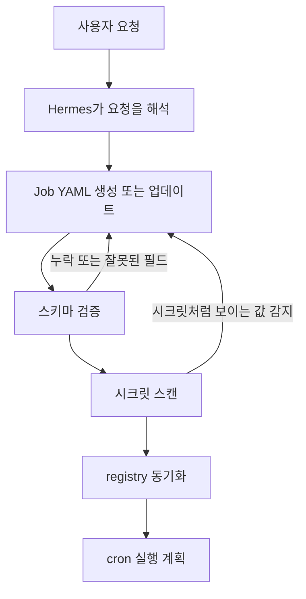

# Personal Hermes Agent

> **정제된 AI 에이전트 운영 프로필 및 Job Registry**  
> 개인 AI 에이전트 운영 방식, 작업 정의, 도구 경계, 검증 관행을 공개 가능한 형태로 문서화한 참조 프로젝트입니다.

## 개요

Personal Hermes Agent는 Hermes 기반 AI 에이전트 구성을 위한 공개 안전(public-safe) 운영 프로필을 설명하는 문서 우선(documentation-first) 저장소입니다.

이 저장소는 개인 에이전트 환경을 재사용 가능한 문서, YAML 작업 정의, 게이트웨이/도구 경계, 예약 워크플로 모델, 검증 스크립트, 정제된 예제로 구성하는 방법에 초점을 둡니다.

다음 영역을 다룹니다:

- Job Registry 기반 작업 정의
- Gateway와 Tools의 분리
- Cron 기반 반복 워크플로 모델
- Memory와 Skills 문서화
- Delegation 및 Provider Routing 개념
- 시크릿 스캔과 예제 검증
- 공개 안전 플레이스홀더와 합성 예제

이 저장소는 비공개 런타임 상태를 포함하지 않도록 설계되었으며, 공개 전 검증을 전제로 합니다. 실제 토큰, OAuth 시크릿, Discord 채널 ID, 원본 개인 메모리, 로그, 세션, 데이터베이스, 게이트웨이 상태는 의도적으로 제외합니다.

## 존재 이유

개인 AI 에이전트를 운영하는 일은 프롬프트만의 문제가 아닙니다. 유지보수 가능한 에이전트 구성에는 지속 가능한 작업 정의, 명확한 도구 경계, 예약 실행 모델, 모델/프로바이더 선택 규칙, 공개 전 점검 절차가 함께 필요합니다.

이 저장소는 그런 운영 모델을 작고 점검 가능한 구조로 정리합니다:

- 반복 작업은 재사용 가능한 skill 또는 job 정의로 표현합니다.
- 작업 요청은 검토 가능한 YAML 산출물로 문서화합니다.
- 외부 입력은 내부 계획 및 도구 실행과 분리합니다.
- 공개 예제는 공유 전에 정제합니다.
- 검증 스크립트는 변경 사항을 공개하기 전 기본 점검을 제공합니다.

목표는 실제 라이브 환경을 노출하지 않으면서 에이전트 운영 프로필의 구조와 패턴을 설명하는 것입니다.

## 설계 목표

| 목표 | 설명 |
| --- | --- |
| 재현 가능한 구조 | 에이전트 운영 산출물을 `docs/`, `jobs/`, `skills/`, `scripts/` 같은 예측 가능한 디렉터리에 유지합니다. |
| 공개 안전 프로필 | 자격 증명, 식별자, 비공개 메모리, 로그, 세션, 데이터베이스, 게이트웨이 상태를 노출하지 않고 아키텍처와 예제를 공유합니다. |
| Job 기반 자동화 | 반복 또는 예약 작업을 검토 및 검증 가능한 `jobs/.../*.yaml` 파일로 모델링합니다. |
| Tool/Gateway 분리 | 외부 입력 라우팅과 외부 작업 실행을 별도의 경계로 다룹니다. |
| 공개 전 검증 | 변경 사항을 공유하기 전에 시크릿 스캔, 예제 검증, Job Registry 검증을 실행합니다. |
| 확장 가능한 에이전트 워크플로 | Memory, Skills, Delegation, Provider Routing을 에이전트 운영 모델의 분리 가능한 구성 요소로 문서화합니다. |

## 아키텍처 요약

| 영역 | 역할 | 저장소 표현 | 운영상 의미 |
| --- | --- | --- | --- |
| Memory | 재사용 가능한 컨텍스트와 메모리 후보 처리 방식을 설명합니다. | `docs/03-memory.md` | 원본 개인 메모리를 노출하지 않으면서 메모리 개념을 명시적으로 다룹니다. |
| Skills | 반복 절차를 재사용 가능한 문서로 정리합니다. | `skills/`, `docs/04-skills.md` | 반복되는 에이전트 워크플로를 더 쉽게 검토하고 재사용할 수 있게 합니다. |
| Tools | 외부 작업이 발생하는 위치를 정의합니다. | `docs/05-tools.md` | 추론과 파일, Git, 웹, 스크립트, API 또는 기타 외부 작업을 분리합니다. |
| Gateway | 외부 입력을 내부 명령 또는 이벤트로 라우팅합니다. | `docs/06-gateway.md`, `diagrams/gateway-flow.mmd` | 외부 진입점을 내부 실행 로직과 분리합니다. |
| Cron | 반복 실행 모델을 설명합니다. | `docs/07-cron-automation.md` | 비공개 런타임 상태를 포함하지 않고 예약 작업을 job 정의와 연결합니다. |
| Job Registry | 자동화 정의를 YAML로 저장합니다. | `jobs/`, `jobs/README.md`, `docs/02-jobs.md` | 반복 작업을 검토 가능한 산출물로 전환합니다. |
| Delegation | 복잡한 작업을 하위 작업으로 나누는 방식을 설명합니다. | `docs/09-delegation.md` | 다단계 또는 역할 기반 에이전트 워크플로 모델을 제공합니다. |
| Provider Routing | 모델/프로바이더 선택 정책의 형태를 설명합니다. | `config/provider-routing.example.yaml`, `docs/08-provider-routing.md` | 작업 유형, 비용, 지연 시간, 기능 요구사항 등이 프로바이더 선택에 어떻게 반영될 수 있는지 보여줍니다. |

## 저장소 구조

```text
.
├── config/
│   ├── README.md
│   ├── example.env
│   ├── hermes.example.yaml
│   └── provider-routing.example.yaml
├── diagrams/
│   └── 아키텍처, 게이트웨이 흐름, job 흐름, 보안 경계를 위한 Mermaid 다이어그램
├── docs/
│   ├── 00-overview.md
│   ├── 01-architecture.md
│   ├── 02-jobs.md
│   ├── 03-memory.md
│   ├── 04-skills.md
│   ├── 05-tools.md
│   ├── 06-gateway.md
│   ├── 07-cron-automation.md
│   ├── 08-provider-routing.md
│   ├── 09-delegation.md
│   ├── 10-operation-guide.md
│   ├── 11-job-registry-catalog-2026-05-12.md
│   └── archive/
├── jobs/
│   ├── README.md
│   ├── daily/
│   ├── weekly/
│   ├── monitoring/
│   ├── research/
│   ├── maintenance/
│   └── examples/
├── prompts/
│   └── job 추가 및 유지를 위한 워크플로 프롬프트
├── scripts/
│   ├── README.md
│   └── examples/
│       ├── scan-for-secrets.sh
│       ├── validate-examples.sh
│       ├── validate-job-registry.sh
│       └── sync-job-registry.sh
└── skills/
    ├── README.md
    └── examples/
        ├── code-review-skill/
        └── research-skill/
```

이 저장소의 주요 문서/예제 형식은 Markdown, YAML, Shell, Mermaid입니다. 패키징된 런타임이 아니라 문서 및 운영 설계 프로젝트입니다.

## Job Registry 워크플로

Job Registry 패턴은 자동화 요청을 `jobs/.../*.yaml` 아래의 버전 관리 가능한 YAML 산출물로 전환합니다.

각 job에는 `jobs/README.md`에 문서화된 필수 필드가 포함되어야 합니다:

- `name`
- `description`
- `schedule`
- `trigger`
- `input`
- `steps`
- `output`
- `tools`
- `model`
- `safety`
- `status`

아래 다이어그램은 실제 운영 파이프라인을 그대로 나타내기보다, Job Registry가 어떤 검토 흐름을 갖는지 설명하는 개념적 예시입니다.



이 흐름은 반복 작업을 눈에 보이고 검토 가능한 형태로 유지합니다. 예약 작업을 암묵적인 대화 상태로 취급하는 대신, 이 저장소는 해당 작업을 점검, 수정, 검증, 실행 계획과 동기화할 수 있는 YAML 파일로 표현합니다.

## Gateway와 Tool 경계

이 저장소는 게이트웨이 입력과 도구 실행을 별도의 관심사로 다룹니다.

참조 모델에서 Gateway는 외부 입력과 내부 작업 정의 사이의 경계입니다. 외부 이벤트, 메시지, 웹훅, 명령을 수신하고 에이전트가 해석할 수 있는 형태로 매핑하는 계층으로 설명할 수 있습니다.

Tools는 외부 작업이 실제로 발생하는 경계입니다. 파일 변경, Git 작업, 웹 접근, 스크립트 실행, API 호출 및 기타 부수 효과는 이 경계 뒤에 위치합니다.

이 분리는 참조 구조가 특정 에이전트 프레임워크에 종속되지 않도록 합니다. 또한 이 저장소가 완성된 MCP 서버 또는 클라이언트 구현을 포함한다고 주장하지 않으면서, 향후 MCP 스타일 도구 통합을 설명할 여지를 남깁니다.

## 보안 및 정제

이 저장소는 비공개 런타임 환경과 분리되도록 설계되어 있으며, 공개 전 검증 절차를 전제로 합니다.

포함하지 않는 항목은 다음과 같습니다:

- 실제 토큰
- OAuth 시크릿
- 실제 채널 ID
- 원본 개인 메모리
- 프로덕션 로그
- 비공개 데이터베이스 덤프
- 런타임 세션
- 게이트웨이 상태
- 비공개 파일시스템 경로
- 내부 전용 시스템 이름

공개 예제는 설정 값이 들어갈 위치에 `<YOUR_...>` 및 `${...}` 같은 플레이스홀더를 사용합니다.

정제 원칙:

- 설정 값 예제에는 플레이스홀더만 사용합니다.
- 문서와 job에는 합성 예제 또는 정제된 예제를 사용합니다.
- 공개 문서를 라이브 자격 증명 및 런타임 상태와 분리합니다.
- 생성된 job YAML은 검토 전까지 제안으로 취급합니다.
- 변경 사항을 공개하기 전에 검증 스크립트를 실행합니다.

목적은 어떤 시크릿도 절대 나타날 수 없다는 것을 증명하는 데 있지 않습니다. 목적은 공개 경계를 명확히 하고, 공유 전에 흔한 실수를 잡아낼 수 있는 가벼운 점검 절차를 제공하는 것입니다.

## 검증

이 저장소에는 `scripts/examples/` 아래에 가벼운 Shell 스크립트가 포함되어 있습니다.

```bash
scripts/examples/scan-for-secrets.sh
scripts/examples/validate-examples.sh
scripts/examples/validate-job-registry.sh
```

| 스크립트 | 목적 |
| --- | --- |
| `scripts/examples/scan-for-secrets.sh` | 공개 저장소에 포함되어서는 안 되는 시크릿 유사 문자열과 값을 점검합니다. |
| `scripts/examples/validate-examples.sh` | 공개 예제 설정, 프롬프트, job 샘플에 대한 기본 점검을 수행합니다. |
| `scripts/examples/validate-job-registry.sh` | Job Registry YAML 파일의 필수 필드와 기본 구조를 검증합니다. |

Registry 동기화 데모도 포함되어 있습니다:

```bash
scripts/examples/sync-job-registry.sh
```

이 스크립트는 cron runner 또는 운영 프로세스가 registry를 읽는 방식을 예시합니다. 이는 예제 흐름이며, 완전한 프로덕션 스케줄러가 아닙니다.

## 예시 사용 사례

이 저장소는 다음 내용을 설명하거나 프로토타입화하는 데 사용할 수 있습니다:

- 반복되는 개인 AI 에이전트 작업을 YAML job으로 구성하기
- 도구 호출이 발생할 수 있는 위치 문서화하기
- 외부 입력 라우팅과 내부 실행 분리하기
- 공개 안전 에이전트 프로필 예제 만들기
- 공유 예제에서 시크릿처럼 보이는 값 점검하기
- provider-routing 정책 형태 설명하기
- cron 기반 작업 계획 모델링하기
- 반복 워크플로를 위한 재사용 가능한 skill 문서 작성하기

이 예제들은 구조와 프로세스를 설명합니다. 나열된 모든 흐름이 이 저장소에서 라이브 서비스로 실행되고 있음을 의미하지는 않습니다.

## 이 저장소가 아닌 것

이 저장소는 의도적으로 범위가 제한되어 있습니다.

다음에 해당하지 않습니다:

- 전체 비공개 런타임 환경
- 프로덕션 배포 저장소
- 라이브 Discord 봇 또는 호스팅된 게이트웨이 서비스
- 자격 증명 저장소
- 데이터베이스 덤프, 세션 아카이브 또는 로그 내보내기
- 원본 비공개 메모리의 출처
- 완성된 MCP 서버 또는 클라이언트 구현
- 특정 프레임워크 기반 에이전트 애플리케이션
- LangChain 애플리케이션 구현
- Python, JavaScript 또는 Java 애플리케이션 구현

이 저장소는 구조, 예제, 검증 관행을 문서화합니다. 실제 라이브 사용에는 적절한 시크릿 관리, 권한 관리, 로깅 정책, 실패 처리, 환경 격리, 런타임별 테스트가 필요합니다.

## 로드맵

가능한 향후 개선 사항은 다음과 같습니다:

- 최소 MCP 호환 도구 어댑터 예제
- Python 기반 registry 검증기
- GitHub Actions 검증 워크플로
- 감사 로그 예제
- 권한 정책 예제
- 에이전트 프레임워크 어댑터 예제
- 더 자세한 job 생명주기 문서
- Job Registry 파일용 JSON Schema
- 공개 안전 모니터링 리포트 예제
- 비용, 지연 시간, 작업 유형 메모를 포함한 provider-routing 예제 확장

이 항목들은 로드맵 아이디어이며, 구현된 기능으로 제시되지 않습니다.

## 라이선스 / 참고 사항

현재 이 저장소에는 라이선스 파일이 포함되어 있지 않습니다. 재사용, 배포 또는 외부 기여 수락 전에 명시적인 라이선스를 추가해야 합니다.

이 저장소에는 공개 안전 예제만 포함되어야 합니다. 이슈나 풀 리퀘스트에는 자격 증명, 비공개 로그, 원본 개인 메모리, 실제 채널 식별자, 데이터베이스 덤프 또는 기타 민감한 운영 데이터가 포함되어서는 안 됩니다.
