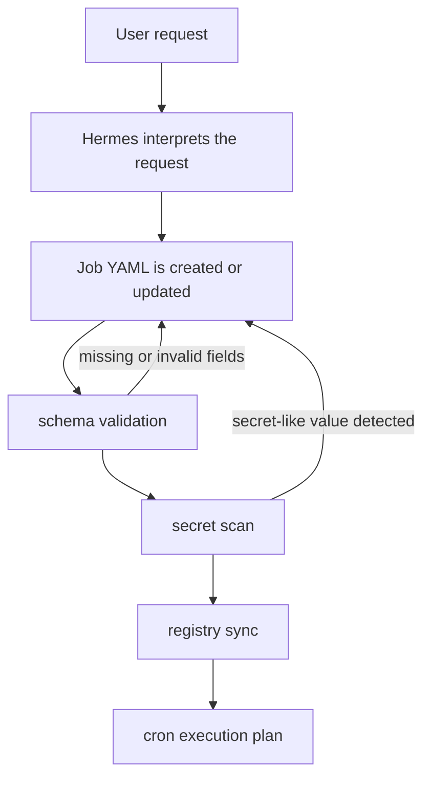

# Personal Hermes Agent

> **Sanitized AI Agent Operations Profile & Job Registry**  
> A public-safe reference project for documenting personal AI agent operations, job definitions, tool boundaries, and validation practices.

## Overview

Personal Hermes Agent is a documentation-first repository that describes a public-safe operations profile for a Hermes-based AI agent setup.

The repository focuses on how a personal agent environment can be organized around reusable documentation, YAML job definitions, gateway/tool boundaries, scheduled workflow models, validation scripts, and sanitized examples.

It covers the following areas:

- Job Registry-based task definitions
- Gateway and Tools separation
- Cron-based recurring workflow models
- Memory and Skills documentation
- Delegation and Provider Routing concepts
- Secret scanning and example validation
- Public-safe placeholders and synthetic examples

This repository does not include private runtime state. Real tokens, OAuth secrets, Discord channel IDs, raw personal memory, logs, sessions, databases, and gateway state are intentionally excluded.

## Why This Exists

Operating a personal AI agent is not only about prompts. A maintainable agent setup also needs durable task definitions, clear tool boundaries, scheduled execution models, model/provider selection rules, and publication checks.

This repository captures that operating model in a small, inspectable structure:

- Repeated work is represented as reusable skills or job definitions.
- Job requests are documented as reviewable YAML artifacts.
- External inputs are separated from internal planning and tool execution.
- Public examples are sanitized before they are shared.
- Validation scripts provide basic checks before changes are published.

The goal is to describe the structure and patterns of an agent operations profile without exposing the live environment itself.

## Design Goals

| Goal | Description |
| --- | --- |
| Reproducible structure | Keep agent operations artifacts in predictable directories such as `docs/`, `jobs/`, `skills/`, and `scripts/`. |
| Sanitized public profile | Share architecture and examples without exposing credentials, identifiers, private memory, logs, sessions, databases, or gateway state. |
| Job-based automation | Model repeated or scheduled work as `jobs/.../*.yaml` files that can be reviewed and validated. |
| Tool/Gateway separation | Treat external input routing and external action execution as separate boundaries. |
| Validation before publication | Run secret scan, example validation, and Job Registry validation before sharing changes. |
| Extensible agent workflow | Document Memory, Skills, Delegation, and Provider Routing as separable parts of an agent operating model. |

## Architecture Summary

| Area | Role | Repository representation | Operational meaning |
| --- | --- | --- | --- |
| Memory | Describes reusable context and memory-candidate handling | `docs/03-memory.md` | Keeps the concept of memory visible without exposing raw personal memory. |
| Skills | Captures repeated procedures as reusable documents | `skills/`, `docs/04-skills.md` | Makes recurring agent workflows easier to review and reuse. |
| Tools | Defines where external actions happen | `docs/05-tools.md` | Separates reasoning from file, Git, web, script, API, or other external operations. |
| Gateway | Routes external inputs into internal commands or events | `docs/06-gateway.md`, `diagrams/gateway-flow.mmd` | Keeps external entry points separate from internal execution logic. |
| Cron | Describes recurring execution models | `docs/07-cron-automation.md` | Connects scheduled work to job definitions without embedding private runtime state. |
| Job Registry | Stores automation definitions as YAML | `jobs/`, `jobs/README.md`, `docs/02-jobs.md` | Turns recurring work into reviewable artifacts. |
| Delegation | Describes splitting complex work into sub-tasks | `docs/09-delegation.md` | Provides a model for multi-step or role-based agent workflows. |
| Provider Routing | Describes model/provider selection policy shape | `config/provider-routing.example.yaml`, `docs/08-provider-routing.md` | Shows how task type, cost, latency, or capability can inform provider choice. |

## Repository Structure

```text
.
├── config/
│   ├── README.md
│   ├── example.env
│   ├── hermes.example.yaml
│   └── provider-routing.example.yaml
├── diagrams/
│   └── Mermaid diagrams for architecture, gateway flow, job flow, and security boundaries
├── docs/
│   ├── 00-overview.md
│   ├── 01-architecture.md
│   ├── 02-jobs.md
│   ├── 03-memory.md
│   ├── 04-skills.md
│   ├── 05-tools.md
│   ├── 06-gateway.md
│   ├── 07-cron-automation.md
│   ├── 08-provider-routing.md
│   ├── 09-delegation.md
│   ├── 10-operation-guide.md
│   ├── 11-job-registry-catalog-2026-05-12.md
│   └── archive/
├── jobs/
│   ├── README.md
│   ├── daily/
│   ├── weekly/
│   ├── monitoring/
│   ├── research/
│   ├── maintenance/
│   └── examples/
├── prompts/
│   └── Workflow prompts for adding and maintaining jobs
├── scripts/
│   ├── README.md
│   └── examples/
│       ├── scan-for-secrets.sh
│       ├── validate-examples.sh
│       ├── validate-job-registry.sh
│       └── sync-job-registry.sh
└── skills/
    ├── README.md
    └── examples/
        ├── code-review-skill/
        └── research-skill/
```

The repository is centered on Markdown, YAML, Shell, and Mermaid. It is a documentation and operations-design project rather than a packaged runtime.

## Job Registry Workflow

The Job Registry pattern turns an automation request into a versioned YAML artifact under `jobs/.../*.yaml`.

Each job is expected to include the required fields documented in `jobs/README.md`:

- `name`
- `description`
- `schedule`
- `trigger`
- `input`
- `steps`
- `output`
- `tools`
- `model`
- `safety`
- `status`



This flow keeps repeated work visible and reviewable. Instead of treating a scheduled action as an implicit conversation state, the repository represents it as a YAML file that can be inspected, edited, validated, and synchronized with an execution plan.

## Gateway and Tool Boundary

The repository treats gateway input and tool execution as separate concerns.

A Gateway is the boundary between external inputs and internal work definitions. It can be described as the layer that receives an external event, message, webhook, or command and maps it into something the agent can interpret.

Tools are the boundary where external actions happen. File changes, Git operations, web access, script execution, API calls, and other side effects belong behind this boundary.

This separation keeps the reference structure independent of a specific agent framework. It also leaves room for MCP-style tool integration later, without claiming that this repository contains a finished MCP server or client implementation.

## Security and Sanitization

This repository is designed to remain separate from the private runtime environment.

It does not include:

- Real tokens
- OAuth secrets
- Real channel IDs
- Raw personal memory
- Production logs
- Private database dumps
- Runtime sessions
- Gateway state
- Private filesystem paths
- Internal-only system names

Public examples use placeholders such as `<YOUR_...>` and `${...}` where configuration values would normally appear.

Sanitization principles:

- Use placeholder-only examples for configuration values.
- Use synthetic or sanitized examples for documents and jobs.
- Keep public documentation separate from live credentials and runtime state.
- Treat generated job YAML as a proposal until reviewed.
- Run validation scripts before publishing changes.

The purpose is not to prove that no secret can ever appear. The purpose is to make the publication boundary explicit and to provide lightweight checks that catch common mistakes before sharing.

## Validation

The repository includes lightweight Shell scripts under `scripts/examples/`.

```bash
scripts/examples/scan-for-secrets.sh
scripts/examples/validate-examples.sh
scripts/examples/validate-job-registry.sh
```

| Script | Purpose |
| --- | --- |
| `scripts/examples/scan-for-secrets.sh` | Checks for secret-like strings and values that should not appear in the public repository. |
| `scripts/examples/validate-examples.sh` | Performs basic checks for public example configuration, prompts, and job samples. |
| `scripts/examples/validate-job-registry.sh` | Verifies required fields and basic structure for Job Registry YAML files. |

A registry sync demonstration is also included:

```bash
scripts/examples/sync-job-registry.sh
```

This script represents how a cron runner or operations process could read the registry. It is an example flow, not a full production scheduler.

## Example Use Cases

This repository can be used to explain or prototype:

- Organizing repeated personal AI agent tasks as YAML jobs
- Documenting where tool calls may occur
- Separating external input routing from internal execution
- Building a public-safe agent profile example
- Checking shared examples for secret-like values
- Describing provider-routing policy shape
- Modeling cron-based task plans
- Writing reusable skill documents for repeated workflows

These examples describe structure and process. They do not imply that every listed flow is running as a live service from this repository.

## What This Repository Is Not

This repository is intentionally limited in scope.

It is not:

- The full private runtime environment
- A production deployment repository
- A live Discord bot or hosted gateway service
- A credential store
- A database dump, session archive, or log export
- A source of raw private memory
- A finished MCP server or client implementation
- A framework-specific agent application
- A LangChain application implementation
- A Python, JavaScript, or Java application implementation

The repository documents structure, examples, and validation practices. Any live use would need proper secret management, permissions, logging policy, failure handling, environment isolation, and runtime-specific tests.

## Roadmap

Possible future improvements include:

- Minimal MCP-compatible tool adapter example
- Python-based registry validator
- GitHub Actions validation workflow
- Audit log example
- Permission policy example
- Agent framework adapter example
- More detailed job lifecycle documentation
- JSON Schema for Job Registry files
- Public-safe monitoring report examples
- Expanded provider-routing examples with cost, latency, and task-type notes

These items are roadmap ideas and are not presented as implemented features.

## License / Notes

No license file is currently included in this repository. Add an explicit license before reusing, distributing, or accepting external contributions.

Only public-safe examples belong in this repository. Issues or pull requests should not contain credentials, private logs, raw personal memory, real channel identifiers, database dumps, or other sensitive operational data.
